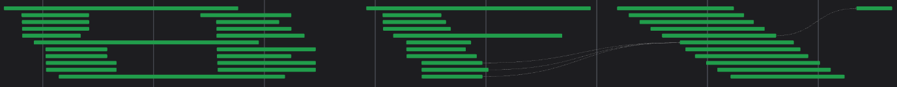

# autobfx

## NOTES IN DEV

## Getting started

### Installation

Dev install from GitHub: `git clone https://github.com/Ulthran/autobfx/`
`cd autobfx/`
`venv env/`
`source env/bin/activate`
Install (optionally in editable mode): `pip install -e .`
Fun dummy run to see that it's working: `autobfx run tests/data/example_project/ logo:logo_flow`