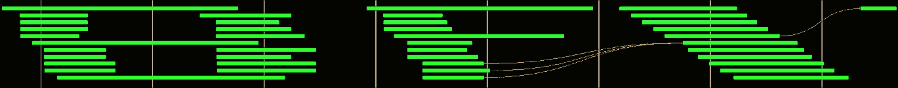

# autobfx

## NOTES IN DEV

## Getting started

After `git clone`ing the repo, run `python -m venv env/` to create a virtual environment, `source env/bin/activate` to activate it, and `pip install -r requirements.txt` to install the necessary packages. Then open up one terminal and start the prefect server with `prefect server start` (it'll show a message and then keep running until you cancel it, leave it running until you're done with AutoBfx), open another terminal and start a local work pool with `prefect work-pool create default` (creating a work pool named `default`) then run  (again, leave it running), and open a third terminal 

